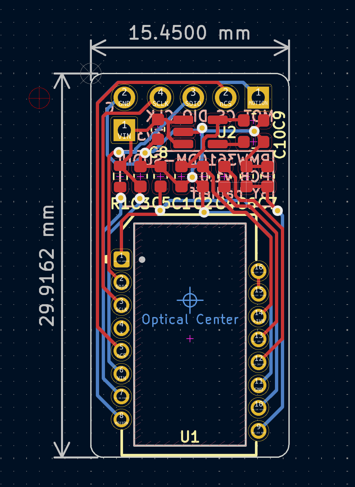

# PMW3610 PCB

[PixArt PMW3610DM-SUDU](https://www.pixart.com/products-detail/21/PMW3610DM-SUDU) low power laser mouse sensor breakout board.

- Base on schematic from [siderakb/pmw3610-pcb](https://github.com/siderakb/pmw3610-pcb).
- Be operated with 3.3V voltage level ONLY.
- Outlined as narrow as possible for side mount on low profile keyboards.

## PCB

Online preview avaliable [here](https://kicanvas.org/?github=https%3A%2F%2Fgithub.com%2Fbadjeff%2Fpmw3610-pcb), powered by [KiCanvas](https://github.com/theacodes/kicanvas).

### BOM

|Ref|Value|Footprint|
|-|-|-|
|C1|3.3uF/16V|SMD 0603|
|C2, C3|100nF|SMD 0603|
|C4|100nF X7R|SMD 0603|
|C5|10nF|SMD 0603|
|C6|10uF X7R|SMD 0603|
|C7|10nF X7R|SMD 0603|
|C8, C9|1uF|SMD 0603|
|C10| DNI |SMD 0603|
|R1|10k|SMD 0603|
|U1|PMW3610|16 Pin|
|U2|TLV74318|SOT-23-5|
|J1, J2|2.54mm Pin header||
- DNI: don't install.
- SMD 0603 (Imperial) aka 1608 Metric.
- PMW3610 needs to be used with LM18-LSI lens.
- `R1` is optional/additional RESET pull up resistor, RESET pin of PMW3610 has a built in weak pull up circuit.
- `U2` LDO can be replace by RT9193-18GB, change `C10` to 22nF.
- Solder extra decoupling capacitors (C4, C6, C7) directly to the pins of the sensor, if needed.

### Board Characteristics

- Copper layer count: 2
- Board thickness: 1.6 mm
- Board overall dimensions: 15.5 x 30 mm

### Voltage level config

- 3.3V logic
- VIN: 3.3V

## License

Available under the [CERN-OHL-P v2](/LICENSE) permissive license.
